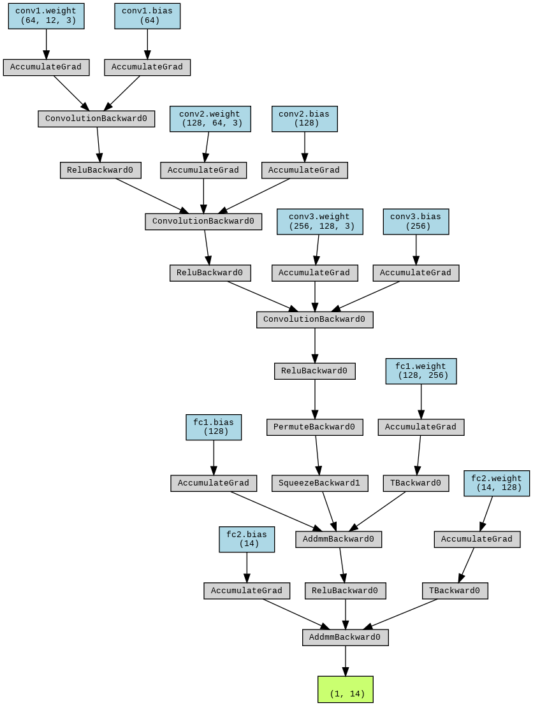

# 1D CNN Model

<div align="center">
  <a href="model_architecture.png">
    
  </a>

</div>

## Overview
This project implements a `1D Convolutional Neural Network (CNN)` using PyTorch for regression tasks on sequential data. The model is designed to handle sequences and make predictions based on learned features.


## Model Architecture
The `oneDCNN` class is a PyTorch nn.Module that consists of several 1D convolutional layers followed by fully connected layers. Below are the details of each component:

1. Convolutional Layers:

- conv1: `nn.Conv1d` with `in_channels=12`, `out_channels=64`, `kernel_size=3`, `stride=1`, `padding=1`
- conv2: `nn.Conv1d` with `in_channels=64`, `out_channels=128`, `kernel_size=3`, `stride=1`, `padding=1`
- conv3: `nn.Conv1d` with `in_channels=128`, `out_channels=256`, `kernel_size=3`, `stride=1`, `padding=1`
- Description: Applies 1D convolutions to extract hierarchical features from input sequences.
2. Fully Connected Layers:

- fc1: `nn.Linear` with `in_features=256`, `out_features=128`
- fc2: `nn.Linear` with `in_features=128`, `out_features=14`
- Description: Transforms the features extracted by the convolutional layers into the final output.
## Hyperparameters
- Learning Rate: 0.001
- Batch Size: 8
- Number of Epochs: 10
## Data Preparation
- Training Data: Loaded from `X_train_padding.npy` and `y_train_padding.npy`
- Conversion: Numpy arrays are converted to PyTorch tensors.

A TensorDataset and DataLoader are created for batching and shuffling the data.

## Training and Evaluation
The training loop runs for 10 epochs, with the loss computed using Mean Squared Error (MSE). Training loss is recorded and plotted to visualize the training process.

### Training Code
```python
for epoch in range(num_epochs):
    epoch_loss = 0.0

    for batch_data, batch_target in dataloader:
        if torch.cuda.is_available():
            batch_data, batch_target = batch_data.to('cuda'), batch_target.to('cuda')
        optimizer.zero_grad()
        outputs = model(batch_data)
        loss = criterion(outputs, batch_target)  # Ensure target shape matches output shape
        loss.backward()
        optimizer.step()

        epoch_loss += loss.item()

    avg_epoch_loss = epoch_loss / len(dataloader)
    print(f'Epoch [{epoch+1}/{num_epochs}], Avg. Loss: {avg_epoch_loss:.4f}')
    all_losses.append(avg_epoch_loss)
```
