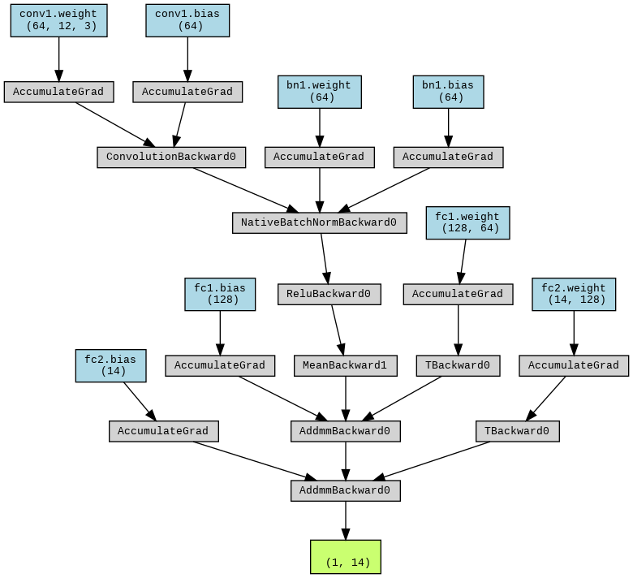

# CNN_Tabluar Model 

<div align="center">
  <a href="model_architecture.png">
    
  </a>

</div>
## Overview
This project implements a Convolutional Neural Network (CNN) for a regression task using PyTorch. The model is designed to handle tabular sequential data and perform predictions based on learned features. This notebook is executed on Google Colab for ease of access to shared data.


## Data Preparation
The data is loaded from Google Drive using Colab integration. Ensure you have mounted the drive and have access to the necessary files.

### Data Files
- `X_train_tabular.npy`: Input features
- `y_train_tabular.npy`: Target values
```python
from google.colab import drive
drive.mount('/content/drive')

import os
drive_path = '/content/drive/MyDrive/DL-ASU_Task_00'
X = np.load(os.path.join(drive_path, 'X_train_tabular.npy'))
y = np.load(os.path.join(drive_path, 'y_train_tabular.npy'))
```
## Model Architecture
The CNN class defines a simple CNN model with one convolutional layer and two fully connected layers:

1. Convolutional Layer:

- conv1: nn.Conv1d with `in_channels=12`, `out_channels=64`, `kernel_size=3`, `stride=1`, `padding=1`
- BatchNorm: nn.BatchNorm1d applied after the convolution
- ReLU Activation: nn.ReLU
2. Fully Connected Layers:

- fc1: `nn.Linear` with `in_features=64`, `out_features=128`
- fc2: `nn.Linear` with `in_features=128`, `out_features=14`
3. Dropout:

- Dropout Rate: 0.1
```python

class CNN(nn.Module):
    def __init__(self):
        super(CNN, self).__init__()
        self.conv1 = nn.Conv1d(12, 64, kernel_size=3, stride=1, padding=1)
        self.bn1 = nn.BatchNorm1d(64)
        self.fc1 = nn.Linear(64, 128)
        self.dropout = nn.Dropout(0.1)
        self.fc2 = nn.Linear(128, 14)
        self.relu1 = nn.ReLU()

    def forward(self, x):
        x = self.conv1(x)
        x = self.bn1(x)
        x = self.relu1(x)
        x = torch.mean(x, dim=2)
        x = self.fc1(x)
        x = self.fc2(x)
        return x
```
## Training
The model is trained using the following configuration:

- `Loss Function`: Mean Squared Error (nn.MSELoss)
- `Optimizer`: Adam with learning rate of `0.001`
- `Batch Size`: `128`
- `Epochs`: `10`
```python
model = CNN()
device = torch.device("cuda" if torch.cuda.is_available() else "cpu")
model.to(device)

criterion = nn.MSELoss()
optimizer = optim.Adam(model.parameters(), lr=0.001)

for epoch in range(epochs):
    model.train()
    running_loss = 0.0
    for batch_X, batch_y in dataloader:
        batch_X, batch_y = batch_X.to(device), batch_y.to(device)
        optimizer.zero_grad()
        outputs = model(batch_X)
        loss = criterion(outputs, batch_y)
        loss.backward()
        optimizer.step()
        running_loss += loss.item()

    avg_train_loss = running_loss / len(dataloader)
    train_losses.append(avg_train_loss)
    print(f'Epoch [{epoch+1}/{epochs}], Loss: {avg_train_loss:.4f}')
```

## Training Loss Visualization
Training loss is plotted and saved as `LossCNN.png`.

```python
plt.plot(train_losses, label='Train Loss')
plt.legend()
plt.show()
plt.savefig('LossCNN.png')
```
## Evaluation
The model's accuracy is computed using the accuracy_score from sklearn. The predictions are compared against true labels.

```python
from sklearn.metrics import accuracy_score

model.eval()
all_preds = []
all_labels = []

with torch.no_grad():
    for batch_X, batch_y in dataloader:
        batch_X, batch_y = batch_X.to(device), batch_y.to(device)
        outputs = model(batch_X)
        _, predicted = torch.max(outputs, 1)
        all_preds.extend(predicted.cpu().numpy())
        all_labels.extend(batch_y.cpu().numpy())

all_preds = np.array(all_preds)
all_labels = np.array(all_labels)

accuracy = accuracy_score(np.argmax(all_labels, axis=1), all_preds)
print(f'Accuracy: {accuracy:.4f}')
```