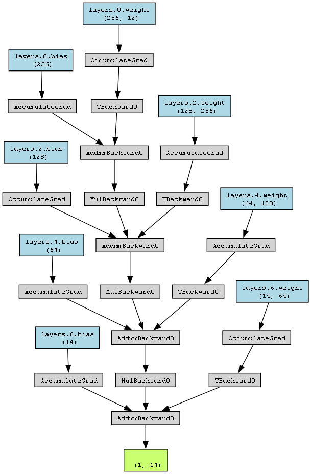

# Linear Model Implementation

<div align="center">
  <a href="model_architecture.png">
    
  </a>

</div>


## Overview
This project implements a fully connected neural network `(DNN)` using PyTorch for a regression task. The model includes dropout for regularization and utilizes a learning rate scheduler to adjust the learning rate based on validation loss.


## Data Preparation
The data is loaded and preprocessed as follows:

1. Data Files:

   - `X_train_tabular.npy`: Features
   - `y_train_tabular.npy`: Target values
2. Preprocessing Steps:

   - Standardize features using `StandardScaler`.
   - Split data into training and validation sets using `train_test_split`.
```python
import numpy as np
from sklearn.preprocessing import StandardScaler
from sklearn.model_selection import train_test_split
import torch
from torch.utils.data import DataLoader, TensorDataset


# Load and preprocess data
X = np.load('../Data/X_train_tabular.npy')
y = np.load('../Data/y_train_tabular.npy')

scaler = StandardScaler()
X = scaler.fit_transform(X)

X_train, X_val, y_train, y_val = train_test_split(X, y, test_size=0.2, random_state=42)

train_dataset = TensorDataset(torch.tensor(X_train, dtype=torch.float32), torch.tensor(y_train, dtype=torch.float32))
val_dataset = TensorDataset(torch.tensor(X_val, dtype=torch.float32), torch.tensor(y_val, dtype=torch.float32))

train_loader = DataLoader(train_dataset, batch_size=64, shuffle=True)
val_loader = DataLoader(val_dataset, batch_size=64, shuffle=False)
```
## Model Architecture
The `LinearModel` class defines a fully connected neural network with dropout:

1. Layers:
- Input Layer: Linear transformation from input size to `256`
- Hidden Layers:
  - Linear transformation from `256` to` 128` with dropout
  - Linear transformation from `128` to `64` with dropout
- Output Layer: Linear transformation from `64` to `14`
```python
  import torch
  import torch.nn as nn

class LinearModel(nn.Module):
    def __init__(self):
        super(LinearModel, self).__init__()
        self.layers = nn.Sequential(
            nn.Linear(X_train.shape[1], 256),
            nn.Dropout(0.3),
            nn.Linear(256, 128),
            nn.Dropout(0.3),
            nn.Linear(128, 64),
            nn.Dropout(0.3),
            nn.Linear(64, 14)  # Output shape (batch_size, 14)
        )

    def forward(self, x):
        return self.layers(x)
```
## Training
The model is trained with the following setup:

- Loss Function: Mean Squared Error (`nn.MSELoss`)
- Optimizer: Adam with a learning rate of `0.001`
- Learning Rate Scheduler: ReduceLROnPlateau with a patience of `3` and a factor of `0.5`
- Batch Size: `64`
- Epochs: `10`
```python
import torch.optim as optim
import matplotlib.pyplot as plt

# Initialize model, loss function, optimizer, and scheduler
model = LinearModel()
device = torch.device('cuda' if torch.cuda.is_available() else 'cpu')
model.to(device)

criterion = nn.MSELoss()
optimizer = optim.Adam(model.parameters(), lr=0.001)
scheduler = optim.lr_scheduler.ReduceLROnPlateau(optimizer, 'min', patience=3, factor=0.5)

# Training loop
epochs = 10
train_losses = []
val_losses = []

for epoch in range(epochs):
    model.train()
    train_loss = 0.0
    for batch_X, batch_y in train_loader:
        batch_X, batch_y = batch_X.to(device), batch_y.to(device)
        optimizer.zero_grad()
        outputs = model(batch_X)
        loss = criterion(outputs, batch_y.view(-1, 14))
        loss.backward()
        optimizer.step()
        train_loss += loss.item()

    avg_train_loss = train_loss / len(train_loader)
    train_losses.append(avg_train_loss)

    model.eval()
    val_loss = 0.0
    with torch.no_grad():
        for batch_X, batch_y in val_loader:
            batch_X, batch_y = batch_X.to(device), batch_y.to(device)
            outputs = model(batch_X)
            loss = criterion(outputs, batch_y.view(-1, 14))
            val_loss += loss.item()

    avg_val_loss = val_loss / len(val_loader)
    val_losses.append(avg_val_loss)
    scheduler.step(avg_val_loss)

    print(f'Epoch [{epoch+1}/{epochs}], Train Loss: {avg_train_loss:.4f}, Val Loss: {avg_val_loss:.4f}')

# Plotting Training and Validation Loss
plt.plot(train_losses, label='Train Loss')
plt.plot(val_losses, label='Validation Loss')
plt.legend()
plt.show()
plt.savefig('LossDNN.png')
```