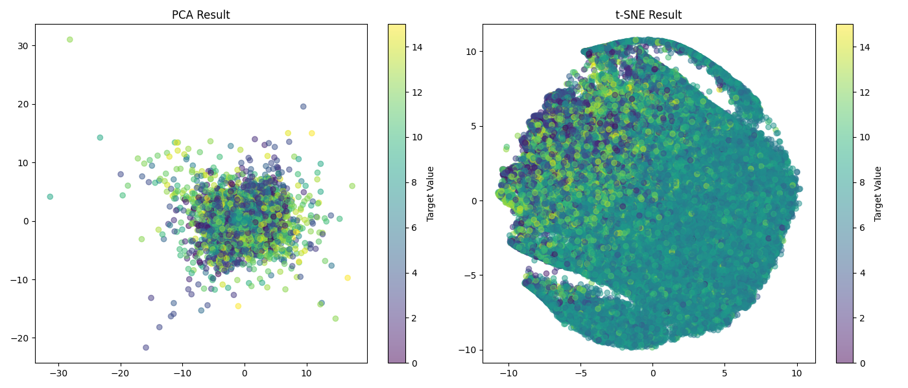
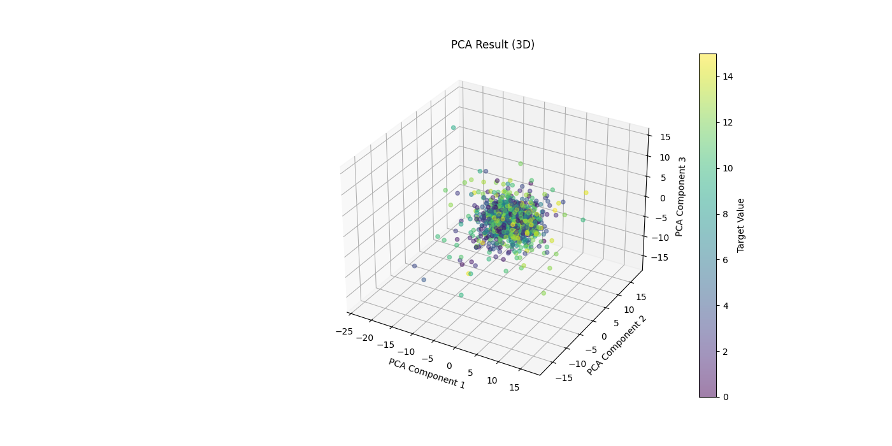
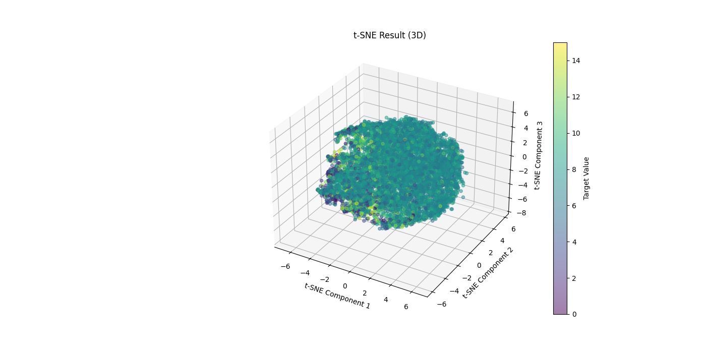

# Dimensionality Reduction and Visualization using PCA and t-SNE
## 2D

## 3D




## Overview
This project demonstrates the use of PCA (Principal Component Analysis) and t-SNE (t-Distributed Stochastic Neighbor Embedding) for dimensionality reduction and visualization of high-dimensional data. The data is first standardized, then reduced to 3 dimensions using both PCA and t-SNE, and finally visualized in 3D plots.


## Data Loading and Preprocessing
The project loads the training data from numpy files and optionally downsamples it for efficient processing. The data is then standardized using StandardScaler.

```python
import numpy as np
import matplotlib.pyplot as plt
from sklearn.decomposition import PCA
from sklearn.manifold import TSNE
from sklearn.preprocessing import StandardScaler
from sklearn.utils import shuffle

# Load data
X = np.load('../Data/X_train_tabular.npy')
y = np.load('../Data/y_train_tabular.npy')

# Downsample the data if necessary
sample_size = 10000
if X.shape[0] > sample_size:
    X, y = shuffle(X, y, random_state=42)
    X = X[:sample_size]
    y = y[:sample_size]

# Standardize the data
scaler = StandardScaler()
X_scaled = scaler.fit_transform(X)
```
## Dimensionality Reduction
PCA and t-SNE are applied to reduce the data to 3 dimensions for visualization.

```python
# PCA for dimensionality reduction to 3 dimensions
pca = PCA(n_components=3)
X_pca = pca.fit_transform(X_scaled)

# t-SNE for dimensionality reduction to 3 dimensions
tsne = TSNE(n_components=3, random_state=42, max_iter=300, perplexity=30, early_exaggeration=12)
X_tsne = tsne.fit_transform(X_scaled)

# Extract single label for coloring
y_single_label = y[:, 0]

# Check shapes for consistency
print(f'X_pca shape: {X_pca.shape}')
print(f'X_tsne shape: {X_tsne.shape}')
print(f'y_single_label shape: {y_single_label.shape}')
```
## Visualization
The reduced data is visualized in 3D plots using Matplotlib.

```python
# Plot PCA results
fig = plt.figure(figsize=(14, 7))
ax = fig.add_subplot(111, projection='3d')
scatter = ax.scatter(X_pca[:, 0], X_pca[:, 1], X_pca[:, 2], c=y_single_label, cmap='viridis', alpha=0.5)
ax.set_xlabel('PCA Component 1')
ax.set_ylabel('PCA Component 2')
ax.set_zlabel('PCA Component 3')
ax.set_title('PCA Result (3D)')
plt.colorbar(scatter, label='Target Value')
plt.savefig('PCA_3D.png')
plt.show()

# Plot t-SNE results
fig = plt.figure(figsize=(14, 7))
ax = fig.add_subplot(111, projection='3d')
scatter = ax.scatter(X_tsne[:, 0], X_tsne[:, 1], X_tsne[:, 2], c=y_single_label, cmap='viridis', alpha=0.5)
ax.set_xlabel('t-SNE Component 1')
ax.set_ylabel('t-SNE Component 2')
ax.set_zlabel('t-SNE Component 3')
ax.set_title('t-SNE Result (3D)')
plt.colorbar(scatter, label='Target Value')
plt.savefig('tSNE_3D.png')
plt.show()
```
## Usage
1. Place your data files (X_train_tabular.npy and y_train_tabular.npy) in the ../Data/ directory.
2. Run the script to perform dimensionality reduction and visualize the results.
```bash
python PCA_Tabular.py
```
## Output
- PCA_3D.png: 3D plot of the PCA results.
- tSNE_3D.png: 3D plot of the t-SNE results.


## Bottlenecks

1. PCA reduces the data to three components, leading to information loss. As a linear technique, PCA assumes that the variance in the data is best represented by linear combinations of the original features. This assumption might not hold for complex, non-linear datasets, causing important patterns to be overlooked.

2. Loading X_train_tabular.npy and y_train_tabular.npy files into memory can become a bottleneck, particularly for large datasets. These datasets may require substantial memory and processing resources, making efficient data handling a challenge.

3. t-SNE is computationally demanding, especially as the dataset size increases. Even with a sample size of 10,000, t-SNE can take a considerable amount of time to run